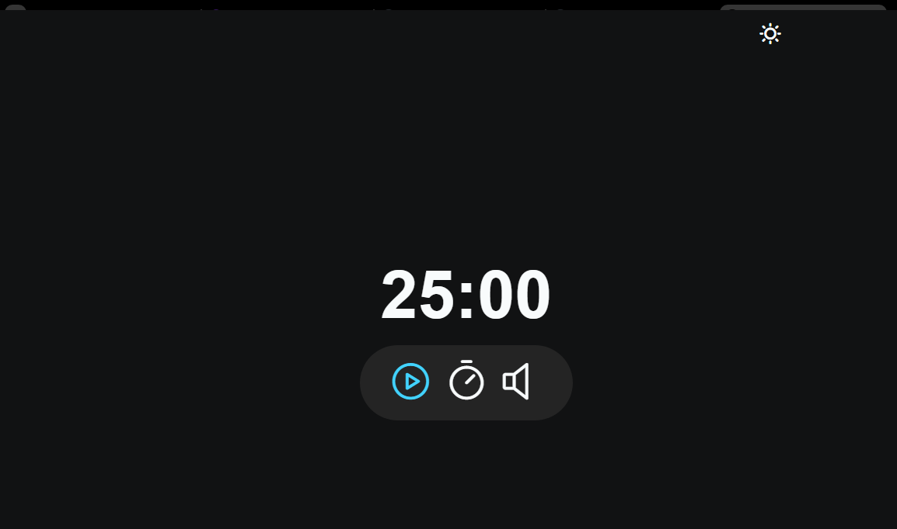

# Projeto Focus-Timer do curso Explorer da Rocketseat

    
    
    

O Focus-Timer é uma aplicação inspirada na técnica Pomodoro, projetada para ajudá-lo a manter o foco e aumentar a produtividade. Além disso, oferece um modo claro (light mode) para facilitar a visualização durante períodos prolongados de uso.

## :exclamation: Pré-requisitos

Navegador web moderno

## :hammer: Intalação

1. Clone o repositório: git clone https://github.com/Raissa-Cardoso/XR-Focus-Timer.git
2. Abra o arquivo `index.html` em seu navegador web.

## :computer: Uso

Após abrir o arquivo `index.html` em seu navegador, você terá acesso ao site do Focus-Timer, onde pode utilizar o timer e alternar entre os modos de visualização.

## :star: Tecnologias utilizadas

- **`HTML`**
- **`CSS`**
- **`Javascript`**
